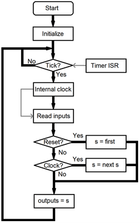

# Simple Sequencer

Simple Sequencer for ELT-23056 course
Includes hardware, mechanics, software and documentation

## **Background**

Simple Sequencer is a DIY-inspired project, which focus on simplification of the electronic and software design of the audio sequencer while maintaining the versatility and dynamic of a music instrument. This, in turns, will help motivating young musicisians and DJs to practice building the Eurorack standard audio synthesizer module.

## **Hardware**

The Simple Sequencer is divided into group of functional blocks:

### **1. General Control**

This block which implements the sequencer functionality using Arduino Nano.

### **2. Gate switches and gate signal generation**

This block allows the Arduino to display the active step, which tells the users the amplitude of the step.

### **3. Control voltage production and handling**

This block allows adjust output voltage and portamento feature.

### **4.Mode selection switches and adjustments**

A group of switches to select operating modes, e.g. full/half steps, forward/backward, clock source and one potentiometer to control internal clock speed.

### **5.Clock and Reset input**

This block routes external gate-level input clock and reset signals to Arduino.

### **6.Power Management**

This block includes power cable connector for Eurorack, some power supply, external +12V power supply (for non-Eurorack operation).

## **Software**

### **Basic Operation**

From the Software point of view, the Sequencer is a directional counter, which can alternate between different moduli, 8 and 4, and two directions forward or backward.

The counter advances whenever a rising edge is detected from the clock source, either external or internal (software) clock generator. The hardware requires two sets of ouputs related to the counter state: 3-bit binary code maps with the input of a 8-bit one-hot multiplexer.

The internal clock generator reads the analog signal from the speed potentiometers and scales that to beats per minute in range 40...200. This, in turns, is converted into millisec per pulse, and produces a clock pulse whenever the millisecond timer counter reaches the specified value.

The clock and reset inputs require filtering to remove noise and contact bounce. In particular, it takes samples of the input signals at fixed rate and waits until the inputs remain stable long enough, then passes that state to the counter logic.

Both the intenal clock generator and filter require a relatively stable time base, which is produced by a Timer/Counter interrupt module every 1ms.

The following figure simplifies the software operation:

### **Development Tools**

[Microchip Studio IDE](https://www.microchip.com/en-us/development-tools-tools-and-software/microchip-studio-for-avr-and-sam-devices): AVR's Library referencing, coding, debugging and simulation tool.

[Proteus 8.11]( https://swdist.tuni.fi/swdist/Proteus/): Schematic and PCB Layout design as well as Hardware graphical simulation.
